<div align="center">


# TOKI

**Your AI coding limits, on the edge of the screen.**

A small notch pinned to a screen edge on Windows. It shows how much of each
coding assistant's usage limit you have burned, and whether that assistant is
still working, done, or waiting on you.

[](https://github.com/mrcrapto/toki/releases/latest)
[](https://www.electronjs.org/)
[](https://github.com/mrcrapto/toki/actions/workflows/ci.yml)
[](LICENSE)
[](https://github.com/mrcrapto/toki/releases/latest)

</div>

<div align="center">
  
</div>

---

## The problem

You are three hours into a session and you do not know whether you have 5% or
50% of your weekly Claude limit left, so you alt-tab to go and check. Meanwhile a
Codex run in another window has been sitting on a yes/no question for eleven
minutes and you had no idea.

Every one of these tools already knows the answer. None of them will tell you
without you going and asking.

## What TOKI does

TOKI reads what each tool already keeps on your PC and puts it on the edge of
your screen, where a glance is enough.

- **One ring per provider**, coloured by how much of the headline window is gone.
- **A live activity arc** while an agent is working, and a **pulsing amber ring**
  when one is blocked waiting on you.
- **The question itself**, in the tool's own words, with the routes to answer it.
- **A desktop notification** the moment something starts waiting: once per
  question, never repeated.

<div align="center">
  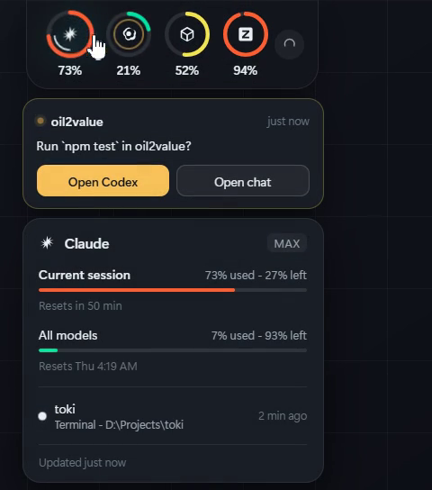
</div>

---

## Table of contents

- [Install](#install)
- [Connect a provider](#connect-a-provider)
- [What it reads, and from where](#what-it-reads-and-from-where)
- [Three ways to connect](#three-ways-to-connect)
- [Is it still working?](#is-it-still-working)
- [Placement](#placement)
- [Themes](#themes)
- [How it works](#how-it-works)
- [Build from source](#build-from-source)
- [The honest gap](#the-honest-gap)
- [Privacy and credentials](#privacy-and-credentials)
- [Troubleshooting](#troubleshooting)
- [Credits](#credits)

---

## Install

Download **`TOKI Setup 1.0.0.exe`** from the
[latest release](https://github.com/mrcrapto/toki/releases/latest) and run it.

<div align="center">
  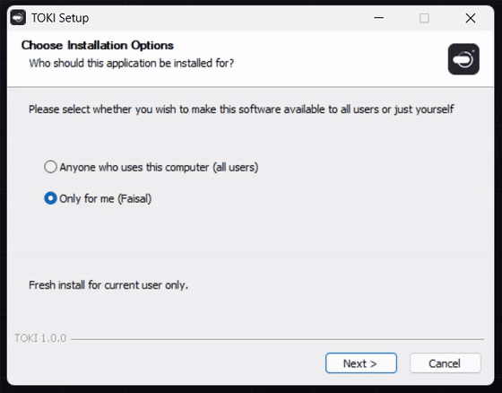
</div>

It installs per user, so there is no administrator prompt and nothing is written
outside your own profile. The installer is not code signed, so Windows SmartScreen
may show **"Windows protected your PC"** on first run. Choose **More info** and
then **Run anyway**, or build it yourself from source below.

After install, TOKI sits on the top edge of your primary screen with a single
**Connect a provider** button, because a fresh install has read nothing from
anybody.

Requires Windows 10 or 11.

---

## Connect a provider

Every provider is **off** until you switch it on. Open Settings from the orb
beside the rings, or from the tray icon, and turn on the ones you use.

<div align="center">
  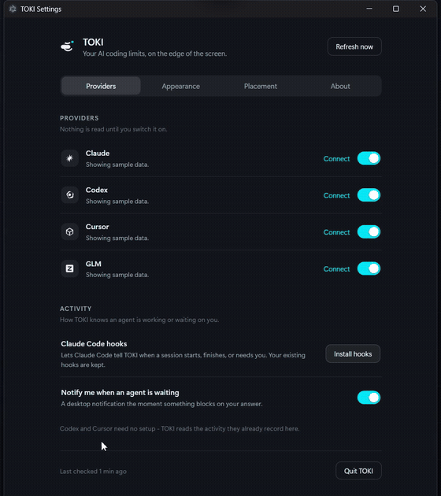
</div>

Notice what the two rows offer. Claude gets a sign-in and no key field. Cursor
gets a key field and no sign-in. **Only the modes a provider genuinely supports
are shown**, because a field that cannot work is worse than no field at all.

---

## What it reads, and from where

Every adapter reads the same place the owning tool itself reads. Nothing is
scraped from a web page, and nothing is guessed.

| Provider | Fidelity | Source |
|---|---|---|
| **Claude Code** | official | The OAuth token Claude Code keeps in `<config dir>/.credentials.json`, queried against the same endpoint Claude Code's own `/usage` command uses. |
| **Codex** | official | Asked live first, with the token Codex already holds. Falls back to the rate-limit snapshots Codex records in its rollout log, found through its thread index in `~/.codex/state_5.sqlite`. |
| **Cursor** | official | The editor's own signed-in session, read from `%APPDATA%\Cursor\User\globalStorage\state.vscdb`. No separate sign-in. |
| **GLM** | official | Z.ai's coding-plan endpoint, with a key borrowed from whichever coding tool already holds one: Claude Code's `settings.json`, ZCode, or OpenCode. |

Each adapter declares its own fidelity, one of `official`, `derived` or `manual`.
A number TOKI worked out for itself is prefixed with `~`, so it is never mistaken
for something a vendor published.

### Two Claude accounts, two rings

Keep a work login apart and you get a second ring:

```powershell
$env:CLAUDE_CONFIG_DIR = "$env:USERPROFILE\.claude-work"
claude
```

That produces a **Claude (work)** ring beside the personal one, with its own
limits and its own row in Settings. The default `~/.claude` always comes first
and the rest follow alphabetically, so the rings never swap places between
launches.

---

## Three ways to connect

Once a provider is on, it takes whichever credential it can get, in this order.

1. **Borrow.** Read what a tool on this PC already holds. No setup, nothing
   stored, and TOKI never signs in.
2. **Sign in to TOKI.** A real OAuth sign-in in your own browser. This exists
   because borrowing is not always possible: Claude Code on Windows sometimes
   writes `.credentials.json` with *empty* token fields, so there is genuinely
   nothing to read however correct the reader is.
3. **API key.** Paste one in. It is encrypted with Windows DPAPI, scoped to your
   Windows account, and if the OS cannot encrypt it TOKI stores **nothing at all**
   rather than leaving a key in plaintext.

Pick a specific mode per provider in Settings, or leave it on Automatic.

| Provider | Borrow | Sign in | API key |
|---|:---:|:---:|---|
| **Claude** | yes | yes | no. The session and weekly windows are *subscription* limits; a pay-as-you-go console key has no such quota to report. |
| **Codex** | yes | no | no. There is no endpoint a key can query. |
| **Cursor** | yes | no | yes, a session token |
| **GLM** | yes | no | yes |

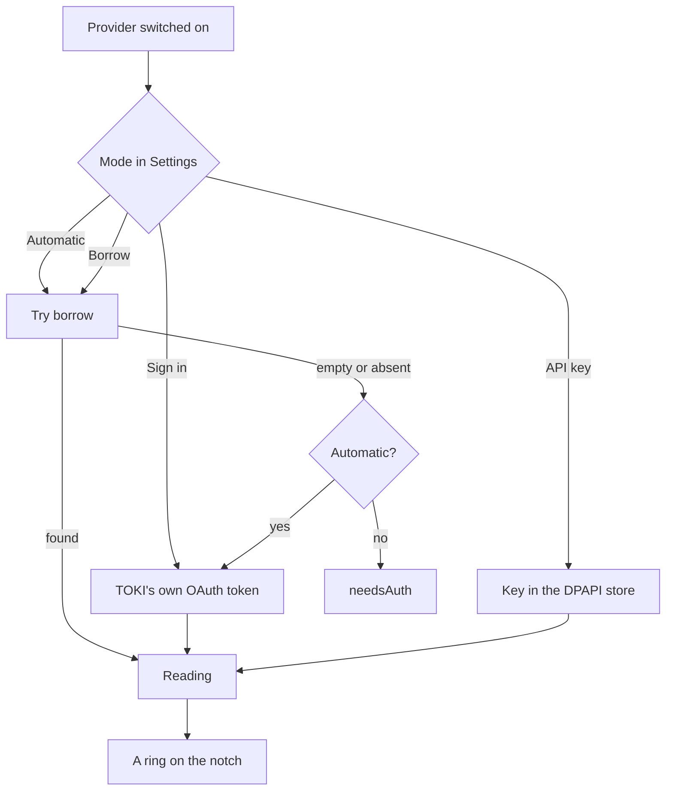

Automatic prefers borrowing because it needs no setup. An explicit mode is
honoured exactly, so someone who chose "API key" is never quietly served a
borrowed reading from a different account.

Switching a provider off stops its credential being read at all and forgets the
readings taken from it. It does not sign you out of the tool that owns the
account, and the row says so.

---

## Is it still working?

A thin arc spins inside a provider's ring while a session is busy, and the ring
becomes a pulsing amber when one is blocked waiting on you. Hover for every live
session by name, where it is running, and what it wants.

| Tool | Setup needed |
|---|---|
| **Codex** | None. TOKI reads the activity it already records on this PC. |
| **Cursor** | None. Same. |
| **Claude Code** | One click. Claude Code publishes no session registry on Windows, so TOKI asks it to report instead. |

**Settings > Activity > Install hooks** adds `SessionStart`, `PreToolUse`,
`Notification` and `Stop` hooks that run a tiny CLI. Your existing hooks are
preserved, and removing them puts the file back.

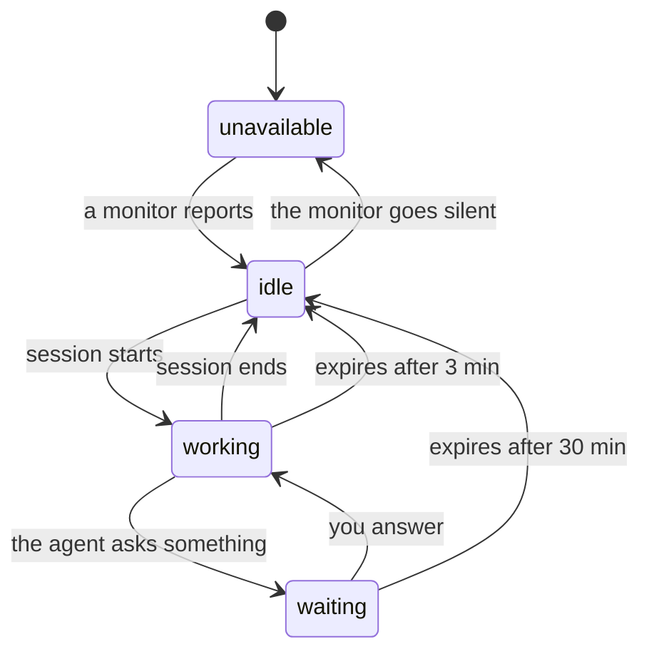

Sessions **expire**, because these are events and not state. A tool killed
mid-turn never sends its "finished" event, and without an expiry the notch would
show it working forever. Busy expires after 3 minutes, waiting after 30.

**"No signal" is reported as such, never as *idle*.** A monitor that says nothing
is not a monitor saying nothing is running.

### When something needs you

An agent blocked on a yes/no is the one state where waiting costs real time, so
it is the one state TOKI interrupts for. A desktop notification fires on the
**transition** into waiting: once per question, never repeatedly, and never for a
session that was already waiting when TOKI started, because that alert would be
about something that happened before it was watching.

The question appears in the notch in the tool's own words, with the ways to
answer it: **open the app** that owns the session (or the folder it is running
in), or **open that provider's web chat**. TOKI does not pretend it can answer
for you. These tools take input in their own terminal or window. What it can do
is make sure you know what is being asked, and where.

---

## Placement

The notch lives on any of the four screen edges. Left and right keep a vertical
column; top and bottom lay the readings out side by side.

<div align="center">
  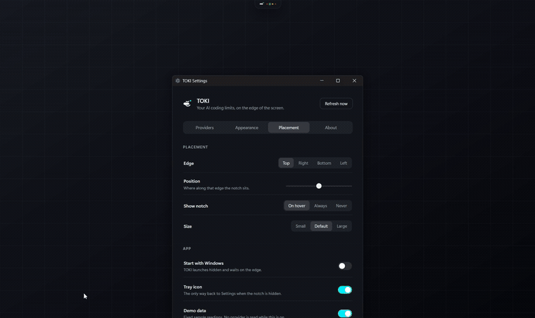
</div>

It pins itself to the **work area**, so a bottom notch rests on the taskbar and
follows when the taskbar moves or auto-hides.

At rest it is a small pill on the edge that unfolds when the pointer reaches it.
That is configurable to always show, or to hide entirely. Settings live in an orb
beside the rings: an arc at rest, a gear on hover. A tray icon offers the same
routes, plus **Refresh now**.

<div align="center">
  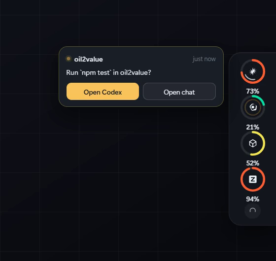
</div>

---

## Themes

Thirty-six built-in themes across six groups.

| Group | Count | Flavour |
|---|:---:|---|
| Essential | 5 | TOKI Dark, OLED Midnight, Daylight, High Contrast, Dim Dusk |
| Soft | 7 | Blush, pastels, peach, mint, cotton candy |
| Nature | 7 | Forest, ocean, desert, sakura, lavender, ember, moss |
| Vivid | 5 | Neon Tokyo, Synthwave 84, Vaporwave, Electric Citrus, Magenta Pulse |
| Retro | 5 | Phosphor Green, Amber CRT, Eight Bit, Sepia Press, Commodore Blue |
| Pro | 7 | Greyscale and editor-flavoured palettes |

<div align="center">
  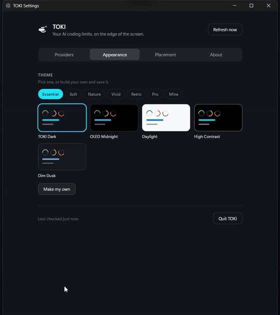
</div>

Every theme is checked by a test for at least **7:1** text contrast,
distinguishable usage bands, an accent visible on the panel, and a panel alpha of
at least **0.95**. Build your own from any of them in
**Settings > Appearance > Make my own**: colours preview live on the real
interface as you pick them, and saved themes sit alongside the built-in ones.
Custom themes derive their translucent surfaces from the solid one, so you cannot
accidentally build a see-through notch.

---

## How it works

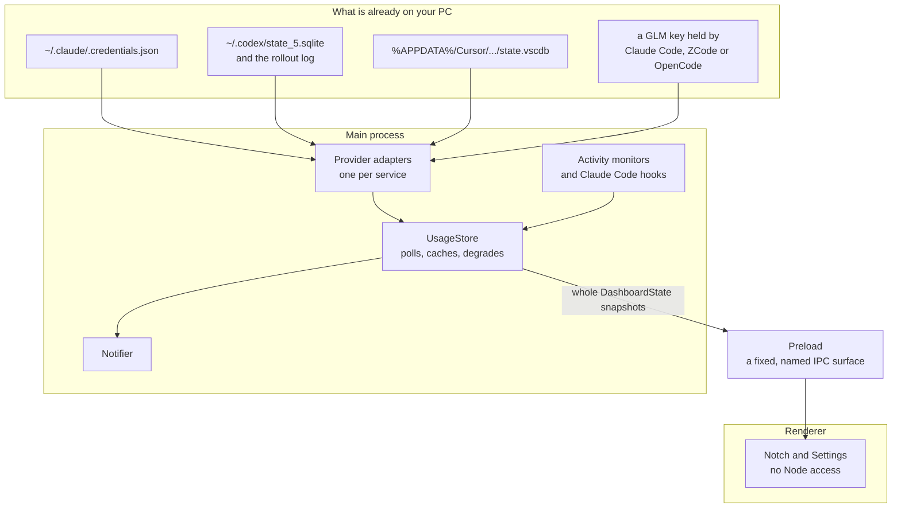

**The one rule: the UI never learns how Claude, Cursor or Codex work.** It renders
`DashboardState` snapshots and nothing else. Every fact about a provider, where
its credential lives, what its response looks like, how stale its numbers are,
stops at the adapter boundary. The renderer cannot read a credential even in
principle.

### What a ring means when things go wrong

Every failure degrades to a **visible status**, keeping the last good reading and
saying how old it is. TOKI never invents a percentage.

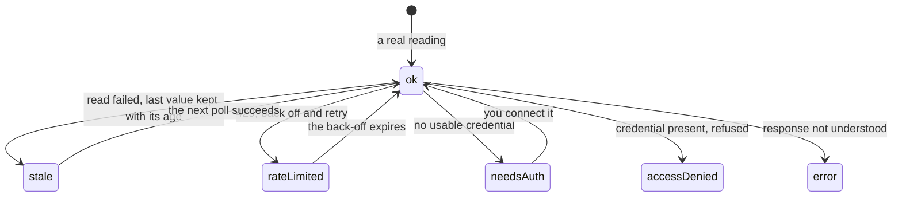

The error kinds are deliberately fine grained, because they call for different
advice. Telling someone to sign in, when they are signed in and merely lack
permission, sends them to fix the wrong thing.

### Two invariants worth knowing

- **A disabled provider is never touched.** No file read, no request.
- **A refresh in flight when settings change is abandoned by generation**, so an
  answer for the old configuration cannot overwrite the new one.

### Polling

| Situation | Interval |
|---|---|
| Something is running | every 60 seconds |
| Nothing is running | every 5 minutes |
| After a 429 | 60s, doubling per consecutive 429, capped at 15 minutes |

The back-off deadline is **persisted**, so relaunching during a penalty waits
instead of spending an attempt on it.

Full design notes, including the Windows-specific decisions, are in
[docs/ARCHITECTURE.md](docs/ARCHITECTURE.md).

---

## Build from source

```sh
git clone https://github.com/mrcrapto/toki.git
cd toki
npm install
npm start
```

| Command | What it does |
|---|---|
| `npm start` | Build and launch |
| `npm run dev` | Build and launch with dev flags |
| `npm run demo` | Fixed sample data. **No provider is read while this is on.** |
| `npm test` | The unit tests |
| `npm run typecheck` | Type check main, renderer and preload |
| `npm run dist` | A Windows installer, into `release/` |

Requires **Node 20 or newer**. The app itself runs on **Electron 44**, whose
bundled Node 24 supplies the built-in `node:sqlite` used to read Cursor's and
Codex's stores, so there is no native module to compile.

Demo mode is a deliberately separate flag from every provider's enable switch:
turning the sample data on must never be mistakable for consent to read a real
credential. Every screenshot and GIF in this README was recorded in demo mode.

---

## The honest gap

This is the part most dashboards leave out.

**No vendor publishes a clean "your session limit is N% used" API for any of
these tools.** Each adapter reads whatever the owning app itself reads from: an
internal endpoint, a local database, a rollout log. Those can change without
notice. Every adapter's response shape is pinned by tests against payloads
recorded from real runs, and every failure degrades to a visible status rather
than an invented number. When a vendor changes something, you get a status, not a
wrong percentage.

**Fresh to fetch is not the same as fresh.** A file-backed reading can be days
old, because the file stops changing the moment you stop using the tool. That is
why Codex is asked *live* first, using its own server and the token Codex already
holds, and only falls back to the rollout log when that will not answer.

**A window whose reset time has already passed reports no figure at all**, rather
than its last one. That number is not merely stale, it is known to be wrong: the
quota has since refilled, and the file itself carries the proof in the timestamp
saying when it stopped being true. The window keeps its name, and the card
explains why the figure is missing.

**A missing ring always means "not set up", never "set up and quietly broken".**
Only providers that have actually connected get a ring. There is one deliberate
exception: a provider that *was* reading and is now failing keeps its ring, with a
stale or error status. That distinction is the whole reason to trust a glance at
it.

**Claude's endpoint returns 429 if polled too hard**, with an unhelpful
`Retry-After: 0`. Obeying that literally means retrying at once, which is what
keeps you rate limited. TOKI treats the server's hint as a floor-raiser only.

**What TOKI cannot do.** It cannot answer a question for you; these tools take
input in their own terminal or window. It cannot make a vendor publish a stable
API. It is Windows only. It does not track spend in currency, only the windows
each tool reports.

---

## Privacy and credentials

Windows has no keychain for these tools to use, so several of these secrets are
plain files in your user profile. TOKI's posture:

- **A fresh install reads nobody's credentials.** Every provider is off until you
  switch it on.
- **Credentials are read only inside an enabled provider's own fetch.** They are
  never copied anywhere, never written to TOKI's state directory, and never
  written to its log.
- **Endpoints are pinned by host and redirects are refused**, so a borrowed token
  cannot be carried off the host it was meant for.
- **Pasted keys are encrypted with Windows DPAPI**, scoped to your Windows
  account. If the OS will not encrypt, TOKI stores nothing rather than falling
  back to plaintext.
- **A borrowed token is never refreshed.** Minting one would mean writing a
  credential this app does not own and racing its owner for it.
- **Nothing leaves your PC** except each provider's own request to its own vendor.
  There is no telemetry, no analytics, and no TOKI server.

See [SECURITY.md](SECURITY.md) to report a vulnerability.

---

## Troubleshooting

**The notch shows nothing after install.** That is correct. Open Settings and
switch on the providers you use.

**A provider says it needs a sign-in but I am signed in.** On Windows, Claude Code
sometimes writes `.credentials.json` with empty token strings, so there is nothing
to borrow. Use **Sign in to TOKI** on that row instead.

**Claude Code sessions never show as working.** Install the hooks from
**Settings > Activity**. Codex and Cursor need no setup.

**A reading is hours old.** File-backed sources stop changing when you stop using
the tool. The card always shows the age of what it is displaying.

**Anything else.** The notch has no window, so anything worth diagnosing goes to:

```
%APPDATA%\TOKI\toki.log
```

Include the relevant lines when opening an issue. The log never contains
credentials.

---

## Credits

**Developed by Faisal Albusaidi.**

TOKI is a Windows reimagining of [Codenotch](https://github.com/vinzdg/codenotch)
by vinzdg, rebuilt on Electron against Windows' own credential locations, with its
own architecture and brand.

Licensed [MIT](LICENSE).

<div align="center">
  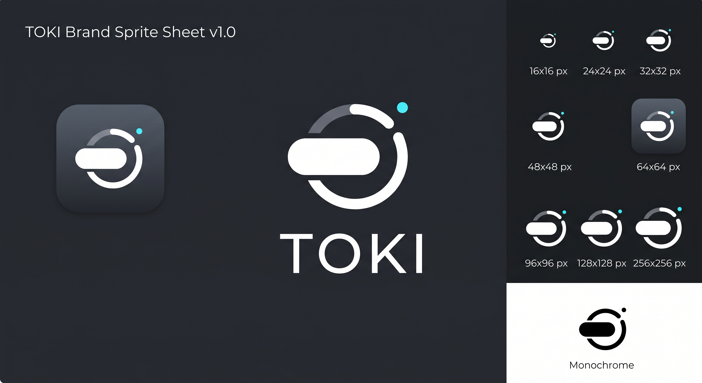
</div>
